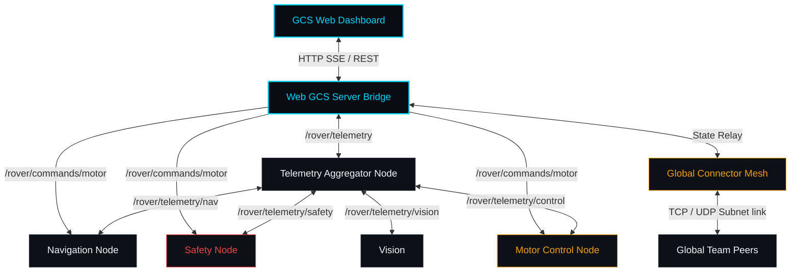

# UCMTC Tactical Ground Control Station (GCS)

> **Version 2.5** · SpaceX-inspired Mission Control UI · WiFi DDS Telemetry Link · Global Team Mesh

---

## 🛰️ System Overview

The **UCMTC Tactical Ground Control Station (GCS)** is a real-time command, telemetry, and operations dashboard designed for mission-critical rover deployments. It combines a premium war-room Web UI (dark, high-contrast, zero visual noise) with a distributed ROS 2 node architecture and a custom multi-peer team mesh network.



### Key Capabilities
- **Tactical Real-time Dashboard**: Unified HUD display for GPS navigation, safety alerts, lane detection optics, onboard compute metrics, and link status.
- **Fail-safe Command Console**: Drive commands, throttle controls, waypoint indexing, and immediate-action E-Stop button with full server-side boundary validation.
- **Global Team Mesh**: Multi-agent network auto-discovering peers (rovers, drones, base stations) via UDP multicast and streaming telemetry via TCP.
- **Distro-Aware ROS 2 Integration**: Sourced and compiled system built using ROS 2 Humble nodes with custom QoS policies (reliable commands, deadlined diagnostic heartbeats).
- **Fallback Simulation**: Built-in mock telemetry loop allowing full frontend testing and verification without ROS 2 installed locally.

---

## 📁 Project Architecture

- 🌐 **[web_gcs/](file:///home/medochi/GS/web_gcs)**: Frontend dashboard layout and server controller.
  - [index.html](file:///home/medochi/GS/web_gcs/index.html): SpaceX / Linear war-room interface.
  - [styles.css](file:///home/medochi/GS/web_gcs/styles.css): Glowing neon dark tactical stylesheets.
  - [app.js](file:///home/medochi/GS/web_gcs/app.js): Live telemetry updating, chart stream, and simulated HUD optics.
  - [web_gcs_server.py](file:///home/medochi/GS/web_gcs/web_gcs_server.py): HTTP + Server-Sent Events (SSE) server with built-in ROS 2 bridge.
- ⚙️ **[rover_ws/src/rover_core/](file:///home/medochi/GS/rover_ws/src/rover_core)**: ROS 2 workspace packages.
  - [navigation_node.py](file:///home/medochi/GS/rover_ws/src/rover_core/rover_core/navigation_node.py): Ramps target speed/heading, updates GPS, and manages waypoints.
  - [safety_node.py](file:///home/medochi/GS/rover_ws/src/rover_core/rover_core/safety_node.py): Triggers geofence, checks mechanical E-stops, and enforces collision avoidance.
  - [vision_node.py](file:///home/medochi/GS/rover_ws/src/rover_core/rover_core/vision_node.py): Simulates lane-tracking confidence, obstacles count, and camera FPS.
  - [motor_control_node.py](file:///home/medochi/GS/rover_ws/src/rover_core/rover_core/motor_control_node.py): Listens to commands, updates sequence numbers, and manages latching.
  - [telemetry_aggregator.py](file:///home/medochi/GS/rover_ws/src/rover_core/rover_core/telemetry_aggregator.py): Consolidates all node topics into a canonical payload.
- 🔗 **[gcs_app/](file:///home/medochi/GS/gcs_app)**: Core Python applications.
  - [global_connector.py](file:///home/medochi/GS/gcs_app/core/global_connector.py): Mesh connector handling UDP discoveries and TCP telemetry sockets.
- 🧪 **[tests/](file:///home/medochi/GS/tests)**: Comprehensive verification.
  - [test_gcs_rover.py](file:///home/medochi/GS/tests/test_gcs_rover.py): Strict unit and UI integration tests.

---

## ⚡ Quick Start

### 1. Standalone Simulation Mode (No ROS 2 needed)
To start the server using simulated telemetry:
```bash
# Sourced virtual environment
.venv/bin/python web_gcs/web_gcs_server.py
```
Open **[http://localhost:8082](http://localhost:8082)** in a modern web browser.

### 2. Full ROS 2 Rover Bringup (Humble LTS)
```bash
# Source ROS 2 environments
source /opt/ros/humble/setup.bash

# Build & install workspace
cd rover_ws
colcon build --packages-select rover_core
source install/setup.bash

# Launch all nodes
ros2 launch rover_core rover_bringup.launch.py
```

---

## 🧪 Verification & Testing

> [!IMPORTANT]
> The test suite includes 39 unit and integration tests covering telemetry parsing, command boundary safety checks, peer socket transfers, and HTTP UI asset routing.

Run all tests locally using the virtual environment interpreter:
```bash
.venv/bin/python -m unittest tests/test_gcs_rover.py -v
```

---

## 🛡️ Quality of Service (QoS) & Constraints

We utilize optimized QoS profiles to guarantee link stability:

- **Motor Commands (`/rover/commands/motor`)**: `RELIABLE` reliability + `KEEP_LAST` history (depth 1) + `LIFESPAN` (200 ms) — ensures commands are not lost, yet prevents executing outdated moves.
- **Safety Heartbeat (`/rover/telemetry/safety`)**: `RELIABLE` reliability + `DEADLINE` (500 ms) + `LIFESPAN` (1 s) — automatically triggers failsafe procedures if safety reports are interrupted.
- **Sensor Streams**: `BEST_EFFORT` reliability + `VOLATILE` durability — minimizes link lag.
